# The Missing Semester of Your CS Education

# 1. 课程概览与 shell

* 分 11 节课

## Shell

* 双引号与单引号的区别
* ​`which`​ 用来查命令位置
* ​`pwd`​ 显示当前工作目录 print working directory
* ​`cd -`​ 在两个最近使用的目录间切换

* 文件和目录的读 写 执行权限

  * 目录的读是指你是否被允许看到这个目录中的文件，即是否允许列出该目录中的内容
  * 目录的写是重命名，删除或添加其下的文件，例如对一个文件有写权限，但对其目录没有写权限，只能修改文件本身，或者把文件删成一个空文件，但无法把文件从磁盘上删除
  * 目录的执行是搜索，即是否允许进入该目录。例如想访问 `/usr/bin`​ 中的 `echo`​ 文件，当前用户必须拥有 `/`​ ，`usr`​，`bin`​ 这三个目录的执行权限

* ​`mv old new`​ 重名名或移动文件
* ​`cp old.md ../new.md`​ 复制
* ​`rm ./test.md`​ 

  `rm -r ./hello`​ 递归删除当前目录下的 hello 目录及其子目录(如果目录中有文件也一删除了)

  `rmdir 目录名`​ 删除空目录

  * 如果我们在当前目录下有 `a/b/c`​的目录结构，虽然其中一个文件也没有，`rmdir a`​ 不会生效
  * 可以用`rmdir a/b/c a/b a`​ 或 `rmdir -p a/b/c`​ 一次性删除

* ​`mkdir my photo`​ 会创建两个目录，用`mkdir "my photo"`​ 或 `mkdir my\ photo`​
* ​`man ls`​ 展示 `ls`​ 命令的手册，比 `ls --help`​更易读，但还是 `tldr`​更好用
* ​`echo hello world > h.txt`​ 会把 `hello world`​ 写入 `h.txt`​ 文件
*  `cat < h.txt`​ 输出 h.txt 文件内容到终端

  ​`cat < h.txt >h2.txt`​ 相当于 `cp h.txt h2.txt`​

  ​`>>`​ 追加， `>`​ 覆盖

* 管道符`|`​​ 将左侧程序的输出作为右侧程序的输入

  ​`ls -l / | tail -n1`​​ 显示 `/`​​ 目录下最后一个文件或目录
* root 用户 ID 为 0，bash 中 `$`​ 表示普通用户，`#`​表示 root 用户
* ​`/sys`​​ 

  ```
  `/sys` 目录是一个虚拟文件系统，它提供了对 Linux 内核运行时状态的访问。它包含了一些用于描述和控制硬件设备、内核模块和其他系统信息的文件和目录。这些文件和目录的内容可以通过读取和写入来与内核进行交互。

  在 `/sys` 目录中，每个设备都有一个对应的目录，其中包含了该设备的各种属性，例如设备状态、驱动程序信息、设备配置等。这些属性可以通过读取和写入相应的文件来修改设备的行为。此外，还有一些与内核相关的信息，例如 CPU、内存、进程等的状态信息。

  总之，`/sys` 目录提供了一个方便的接口，使得用户可以通过读取和写入文件来与内核进行交互，从而方便地管理系统硬件和内核模块。
  ```

  使用 `echo 500 > /sys/class/backlight/intel_backlight/brightness`​ 将亮度调整为 500，但会提示权限不足

  第一反应是在前面加上 `sudo`​，然而只是让 echo 程序以 root 权限运行，重定向符号 > 仍以普通用户权限执行

  两种解决方法

  1. 先用 `sudo su`​ 切换到 root 用户，然后执行 `echo 500 > /sys/class/backlight/intel_backlight/brightness`​

      (`su`​ 和 `sudu su`​ 区别：前者需要输入 root 用户密码，后者需要输入当前用户密码)
  2. 使用管道符让"写入"过程具有root权限。`echo 500 | sudo tee /sys/class/backlight/intel\_backlight/brightness`​

      ​`tee t.txt`​ 和 `cat > t.txt`​的区别：两者都会写入到文件中，但 tee 会在屏幕回显，后者不会

## 作业 - 如何向文本文件添加多行文本

​`cat`​ 命令可以和 `EOF`​ 结合使用来生成一个指定文件中的多行文本。`EOF`​ 是一个占位符，我们可以在其后输入多行文本，表示结束之后输入 `EOF`​，这些文本会保存在指定文件中。

以下是 `cat`​ 命令与 `EOF`​ 结合使用的示例：

```bash
cat > file.txt << EOF
第一行文本
第二行文本
第三行文本
EOF
```

解释：

* ​`cat`​ 命令用于将标准输入内容复制到标准输出或者指定文件。
* ​`>`​ 符号表示将操作的结果输出到指定文件。
* ​`<< EOF`​ 表示输入一个占位符 `EOF`​，让用户输入文本，当用户输入 `EOF`​ 之后，输入结束。
* 这里我们将多行文本输入到 `file.txt`​ 文件中，这三行文本将被保存到 `file.txt`​ 文件中。
* 文本中每一行都要以换行符结尾。

这种方式可以方便地批量生成文本文件的内容。

​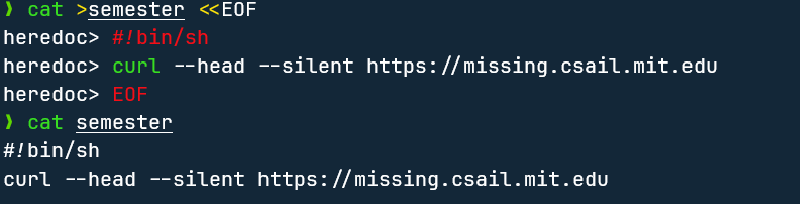​

### 更改权限

```Shell
chmod 777 file.sh
```

### 

‍

# 2. Shell 工具和脚本

* 空格很重要，例如 `foo=bar`​​ 是把 `bar`​​ 赋值给 `foo`​​ ，而 `foo = bar`​​ 会提示 `foo`​​ 不是一条 command(命令)
* 双引号会进行变量替换，单引号则不会。 `echo "Value is $foo"`​​ -> Value is bar ；`echo 'Value is $foo'`​​ ->Value is $foo
* ## Shell 中的 $ 引导的变量

  mcd.sh

  ```shell
  mcd () {
  	mkdir -p "$1"
  	cd "$1"
  }
  ```

  在当前窗口 `source mcd.sh`​ ，mcd 命令会暂时写入PATH，但仅在当前终端生效，重开一个终端窗口并没有这个命令

  ​`$0`​ 表示当前正在执行的脚本或命令的名称。

  ​`$1`​ `$2`​ ... 用于在 shell 脚本中传递参数。最多到9

  ​`$?`​ 表示上一个命令的退出状态码。当你执行一个命令时，如果它成功执行，它将返回 0，否则它将返回非零值。例如 `grep foobar mcd.sh`​ 试图在 mcd.sh 中寻找字符串 foobar，没找到，使用 `echo $?`​ 将返回 1，表示上条命令退出状态码为 1

  ​`$_`​表示上一个参数。它包含了上一个命令的最后一个参数。

  ​`$$`​ 表示当前进程的进程 ID（PID）

  ​`!!`​ 表示上一条命令。当你想要重新执行上一条命令时，可以使用 "!!" 代替它。例如 `sudo !!`​

  ​`$#`​ 表示传递给脚本或函数的参数个数。

  ​`$@`​ 表示所有传递给脚本或函数的参数列表

  ```shell
  #!/bin/bash

  echo "Starting porgram at $(date)"

  echo "Running program $0 with $# arguments with pid $$"

  for file in "$@"; do
  	grep foobar "$file" > /dev/null 2> /dev/null # STDOUT and STDERR
  	if [[ "$?" -ne 0 ]]; then
  		echo "File $file does not have any foobar, adding one"
  		echo "# foobar" >> "$file"
  	fi
  done
  ```

* ​`false || echo "hi"`​ 结果为 hi, 第一条命令失败时才运行第二条

  ​`echo hi || echo ok`​ 结果为 hi，第一条命令成功则不运行第二条
* ​`&&`​ 只有在第一个表达式成功时才运行第二个
* ​`;`​ 将多条语句放在一行
* 将一条命令的输出存储到一个变量中

  ```shell
  foo=$(pwd) # 必须要用括号，这样才知道里面是条命令，不用括号是一个名为 pwd 的变量
  echo $foo
  # 命令替换
  echo "We are in $(pwd)"
  ```

* ​`*`​ 通配符，`?`​ 一个字符

  ```shell
  ls *.py

  # 假设有 project1, project2 project34
  ls project? # 只显示project1, project2
  ```

* ​`{}`​​表示一个命令或变量的扩展。它可以用于创建一组命令或变量

  ```shell
  touch file{1,2,3}.txt # 将创建名为 file1、file2 和 file3 的文件
  touch foo(,5,6,7) # 将创建名为 foo, foo5, foo6, foo7 的文件

  mkdir proj{1,2}
  touch proj{1,2}/file{1,2,3}.py # 使用touch命令创建一个新文件时，如果该文件所在的目录不存在，那么会出现一个错误，提示该目录不存在。

  mkdir foo bar
  touch {foo,bar}/{a...d}
  # 在 foo 和 bar 目录下分别创建 a,b,c,d 四个文件

  # 转换格式
  convert image.png image.jpg
  convert image.{png,jpg} 
  ```
* ```shell
  mkdir foo bar
  touch foo/x bar/y
  diff <(ls foo) <(ls bar)
  ```
* ## shebang

  脚本的 `shebang`​​（也称为 hashbang）是一个特殊的注释，用于指定脚本文件的解释器。在 Unix 和 Linux 系统中，如果一个脚本文件的第一行以 #! 开头，后面紧跟着解释器的路径，则操作系统会使用该路径指定的解释器来执行该脚本文件。

  有一个 python 脚本 example.py，我们不想通过`python ./example.py file1 file2`​的方式执行，而是直接运行它 `./example.py file1 file2`​。利用 sheang 来实现

  记得先给执行权限 chmod a+x example.py

  ```python
  #!/usr/local/bin/python
  import sys
  for arg in reversed(sys.argv[1:]):
  	print(arg)
  ```

  我们可能不知道 python 的具体位置，可写成这样

  ```python
  #!/usr/bin/env python
  import sys
  for arg in reversed(sys.argv[1:]):
  	print(arg)
  ```
* shellcheck 工具：

  ```
  Shellcheck 不是 Bash 或 Zsh 的内置命令，而是一款独立的 Shell 脚本静态分析工具。它可以检查 Shell 脚本中的语法错误、潜在的 bug 和代码风格问题，并提供修复建议。Shellcheck 支持多种 Shell 语言，包括 Bash、Zsh、Dash、Ksh 等。

  要使用 Shellcheck，需要先安装它。在大多数 Linux 发行版中，可以使用包管理器来安装 Shellcheck，例如在 Debian 和 Ubuntu 中，可以使用以下命令安装：

  sudo apt-get install shellcheck
  安装完成后，可以使用 Shellcheck 来检查 Shell 脚本，例如：

  shellcheck script.sh
  这将会检查名为 script.sh 的脚本文件，并输出任何发现的问题。
  ```
* tldr 工具
* ## 查找文件：find / fzf

  ```
  # Find all directories named src
  find . -name src -type d

  # Find all python files that have a folder named test in their path
  find . -path '*/test/*.py' -type f

  # Find all files modified in the last day
  find . -mtime -1

  # Find all zip files with size in range 500k to 10M
  find . -size +500k -size -10M -name '*.tar.gz'

  # Delete all files with .tmp extension
  # {} 表示当前找到的文件名，\; 表示命令结束。
  find . -name '*.tmp' -exec rm {} \;

  # Find all PNG files and convert them to JPG
  # {} 表示当前找到的文件名，{}.jpg 表示将输出文件保存为原始文件名加上 .jpg 后缀。\; 表示命令结束。
  find . -name '*.png' -exec convert {} {}.jpg \;
  ```

  find 的语法很难记住，在 Shell 中，探索替代方案是好的。(it is good to explore alternatives.) 

  ​`fd`​ 是 `find`​ 的一个简单，快速且用户友好的替代品。它提供了一些不错的默认值，如彩色输出，默认正则表达式匹配和 Unicode 支持。它还具有更直观的语法，例如，查找模式 `PATTERN`​ 的语法是 `fd PATTERN`​ 。

  ## fzf

  ​`fzf`​ 是一个命令行模糊搜索工具，可以帮助用户快速在大量数据中查找和选择。下面是 `fzf`​ 命令的基本用法：

  1. 搜索文件名或目录名：在命令行中输入 `fzf`​ 命令，然后按下 `Tab`​ 键，输入要查找的文件名或目录名的一部分即可进行搜索。`fzf`​ 会自动过滤掉不匹配的项，只显示匹配的项，用户可以使用上下箭头来选择需要操作的文件或目录。
  2. 搜索命令历史：在命令行中输入 `Ctrl+R`​ 快捷键，然后输入要搜索的命令的一部分即可进行搜索。`fzf`​ 会自动过滤掉不匹配的项，只显示匹配的项，用户可以使用上下箭头来选择需要执行的命令。
  3. 搜索 Git 提交记录：在 Git 仓库中，输入 `git log`​ 命令并加上 `--color=always | fzf`​ 参数即可使用 `fzf`​ 进行模糊搜索 Git 提交记录。用户可以使用上下箭头来选择需要查看的提交记录。
  4. 搜索环境变量：在命令行中输入 `echo $PATH | tr ':' '\n' | fzf`​ 命令即可使用 `fzf`​ 进行模糊搜索环境变量。用户可以使用上下箭头来选择需要查看的环境变量。

  以上是 `fzf`​ 命令的一些基本用法，还有更多高级用法可以参考 `fzf`​ 的官方文档。
* ## 按文件内容查找/Finding code : grep / ripgrep /ack

  ### grep

  ​`grep`​​ 命令是一个强大的文本搜索工具，它可以在文件中查找指定的字符串，并输出包含该字符串的行。以下是一些 `grep`​​ 命令的使用示例：

  1. 在文件中查找特定字符串：

  ```
  grep "search_term" file.txt
  ```

  这将在 `file.txt`​​ 文件中查找包含 "search_term" 字符串的行，并将它们输出到终端。

  2. 查找多个文件中的字符串：

  ```
  grep "search_term" file1.txt file2.txt file3.txt
  ```

  这将在 `file1.txt`​​、`file2.txt`​​ 和 `file3.txt`​​ 文件中查找包含 "search_term" 字符串的行，并将它们输出到终端。

  3. 递归地在目录中查找字符串：

  ```
  grep "search_term" -r /path/to/directory
  ```

  这将在 `/path/to/directory`​​ 目录及其所有子目录中递归地查找包含 "search_term" 字符串的行，并将它们输出到终端。

  4. 查找不包含指定字符串的行：

  ```
  grep -v "search_term" file.txt
  ```

  这将在 `file.txt`​​ 文件中查找不包含 "search_term" 字符串的行，并将它们输出到终端。

  5. 查找匹配指定模式的行：

  ```
  grep "^start" file.txt
  ```

  这将在 `file.txt`​​ 文件中查找以 "start" 开头的行，并将它们输出到终端。

  6. 使用正则表达式进行搜索：

  ```
  grep -E "pattern1|pattern2" file.txt
  ```

  这将在 `file.txt`​​ 文件中查找包含 "pattern1" 或 "pattern2" 字符串的行，并将它们输出到终端。

  这只是 `grep`​​ 命令的一些基本用法示例，`grep`​​ 命令还有许多其他选项和用法，请查阅 `grep`​​ 命令的文档或手册以获取更详细的信息。

  ### ripgrep

  ```
  # Find all python files where I used the requests library
  rg -t py 'import requests'

  # Find all files (including hidden files) without a shebang line
  rg -u --files-without-match "^#\!"

  # Find all matches of foo and print the following 5 lines/查找所有包含字符串 "foo" 的行，并输出这些行及其后面 5 行的内容
  rg foo -A 5

  # Print statistics of matches (# of matched lines and files )
  在上面的命令后添加 --stats
  ```

* ## 查找历史命令: history / fzf

  ​`Ctrl + R`​

* ## 目录: tree / broot /nnn

  broot 会智能省略类似项目，如 a b c d e ... ; 继续输入，会动态匹配
* ## 目录导航

# 3. vim

> 刚开始用时会让你的效率下降，但当你坚持使用 20 小时后，将回到你原有的编辑效率。之后，它的强大之处会慢慢体现出来。  
> 不难入门，但需要一辈子去精通

​​

* 普通模式下，`x`​ 删除光标所在位置的字符，相当于执行了 `dl`​ 命令（删除当前字符并向左移动光标）。
* tab 里有 window，window 可在 0 个或多个 tab 中同时打开
* window

  在 Vim 中，可以使用以下命令来操作多个窗口：

  1. 分割窗口：使用 `:split`​ 或 `:vsplit`​ 命令可以将当前窗口分割成两个窗口，分别位于上下或左右两侧。其中，`:split`​ 命令用于水平分割窗口，`:vsplit`​ 命令用于垂直分割窗口。
  2. 切换窗口：使用 `Ctrl + w`​ 键加上方向键（上、下、左、右）可以在不同的窗口之间切换焦点。例如，使用 `Ctrl + w + j`​ 可以将焦点切换到下方的窗口。
  3. 调整窗口大小：使用 `Ctrl + w`​ 键加上 `<`​ 或 `>`​ 可以调整当前窗口的宽度，使用 `Ctrl + w`​ 键加上 `+`​ 或 `-`​ 可以调整当前窗口的高度。
  4. 关闭窗口：使用 `:q`​ 命令可以关闭当前窗口。如果当前窗口是唯一的窗口，则会关闭 Vim 编辑器。
  5. 移动窗口：使用 `Ctrl + w`​ 键加上 `H`​、`J`​、`K`​、`L`​ 可以将当前窗口移动到左侧、下方、上方或右侧。

  希望这些命令可以帮助你更好地操作 Vim 中的多个窗口。

* ​`w`​ /`b`​, `0`​/ `$`​, `^`​移动到第一个非空字符

  ​`A`​ 跳到行尾，并进入编辑模式 (例如行尾添加分号)

  ​`Ctrl u`​ / `Ctrl d`​ 向上/下滚动半个屏幕的内容

  ​`gg`​ / `G`​ 顶/底部

  ​`L`​ 移动到当前屏幕最低位置(Lowest)，`M`​ 中间，`H`​ 最高
* ​`f`​ 在**当前行**查找指定字符并跳转到该字符所在的位置，`;`​向尾部查找下一个，`,`​ 向头部
* 撤销 `u`​，重做 `Ctrl r`​
* ​`d`​ 删除，`dw`​ 是删除单词，`de`​ 从当前光标位置到单词结尾的内容
* ​`x`​ 删除光标所在处字符
* ​`**r**`​**​ 后输入一个字符，将光标所在字符修改为输入的字符(改笔误常用)**
* ​`c`​ change，也需配合其他移动操作。如cw，ce，c$，删除后并进入insert
* ​`dd`​ 删除光标所在行，`cc`​ 删除光标所在行并进入insert

---

* ​`v`​ 普通视图模式，进入后上下左右移动，会选择 从进入时光标所在位置 开始的所有内容

* 可输入`次数`​，如`4j`​ 向下移动四次，`3e`​ 移动到三个单词后的末尾，`7dw`​ 删除7个单词，`3dd`​ 删除三行

  配合相对行号，能实现快速行间跳转

* 在`[]`​ `()`​ `""`​ 中进行操作时，`i`​ 修饰符很好用

  例如，`ci[`​ 可删除 `[]`​内所有的内容，然后进入编辑模式

  如果光标此时落在一对符号内，`%`​ 可快速在这对符号间跳转

  ​`a`​ 修饰符，则会连括号本身也删除

* ​`.`​​ 表示重复之前的一个**编辑**命令，例如想给两处都加上点东西，在第一处完成后，光标移动到第二处，按下 `.`​​
* 使用 `/`​​ 和`?`​​ (分别是向下和向上查找) 迅速将光标挪到想要修改的位置， `n`​​ / `N`​​ 是上/下一个
* 使用 vim 调整某几行缩进

  * shift + v 进入 line selection，使用 j/k 选择行
  * 使用 shift +. (即 >) 向右缩进一 tab，< 向左缩进
  * Esc 退出
* 已有代码块需要一新的函数把它包起来

  * 光标停在已有代码块第一行，shift + o 在上方新建一行，输入新函数名和 {
  * Esc，选中已有代码块后调整缩进
  * 光标挪到已有代码块最后一行，o 新建一行，补上 } 并调整缩进

# 4. 数据整理

> 几乎每次使用 `|`​ 运算符时，都会执行某种数据整理操作。

```Shell
ssh myserver journalctl | grep sshd
```

```Shell
ssh myserver 'journalctl | grep sshd | grep "Disconnected from"' | less
```

> 为什么要引用？我们的日志可能非常大，将所有内容流式传输到我们的计算机，然后进行过滤是很浪费的。相反，我们可以在远程服务器上进行过滤，然后在本地处理数据。
>
> `less`​ 给我们提供了一个 “分页器”，允许我们在长输出中上下滚动。

为了在调试命令行时节省一些额外的流量，我们甚至可以将当前过滤的日志保存到文件中，这样我们就不必在开发时访问网络：

```Shell
ssh myserver 'journalctl | grep sshd | grep "Disconnected from"' > ssh.log
less ssh.log
```

​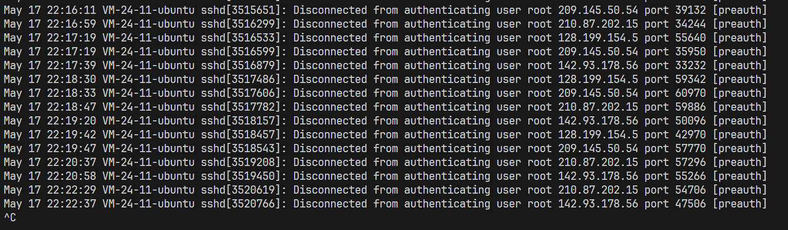​

## sed

​`sed`​ 是一个 “流编辑器”，它是在旧的 `ed`​ 编辑器的基础上构建的。

`s`​ ：替换。例如

将 `.*Disconnected from`​替换为空

```Shell
ssh myserver journalctl
 | grep sshd
 | grep "Disconnected from"
 | sed 's/.*Disconnected from //'
```

### 正则表达式

* ​`.`​ means “any single character” except newline “除换行符外的任何单个字符”。
* ​`*`​ zero or more of the preceding match 前面的匹配模式出现零次或多次。

  ​`.*`​ 贪婪匹配，`.*?`​ 便为非贪婪算法
* ​`+`​ one or more of the preceding match 前面的匹配模式出现一次或多次。
* ​`?`​ 表示匹配前面的字符零次或一次。如 `colou?r`​可匹配 colour 和 color 两个单词
* ​`[abc]`​ any one character of `a`​, `b`​, and `c`​  表示 `a`​ 、 `b`​ 和 `c`​ 中的任意一个字符。

  ```Shell
  echo 'abcaba' | sed -E 's/(ab)*//g'
  -E：表示使用扩展正则表达式。(不然需要用 s/s\(ab\)*//g) 对括号进行非转义
  (ab)*：表示匹配零个或多个连续的 ab 字符串。
  g：表示全局替换，即替换所有匹配到的字符串。
  ```
* ​`(RX1|RX2)`​ either something that matches `RX1`​ or `RX2`​ 要么匹配 RX1 ，要么匹配 RX2 。
* ​`^`​ the start of the line
* ​`$`​ the end of the line

```Shell
journalctl | grep sshd | grep "Disconnected from" | grep invalid | sed 's/VM.*Disconnected from //'
```

​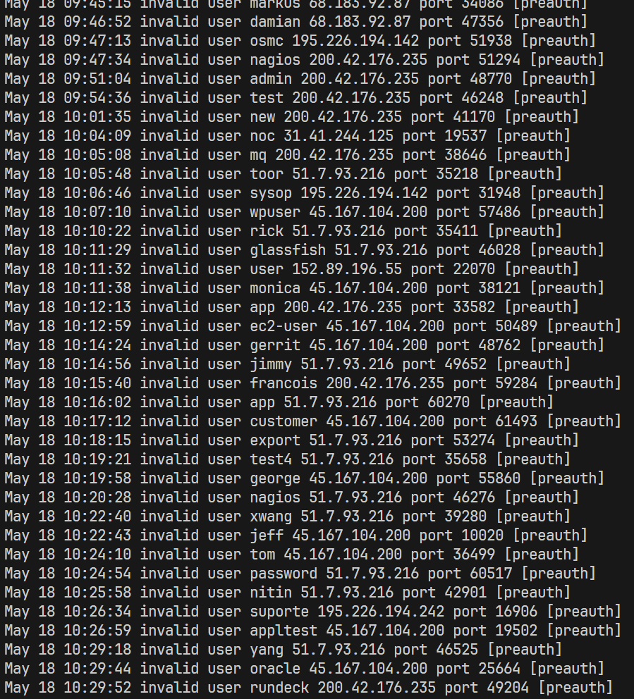​

‍

```Shell
cat ssh.log | head -n5 | sed -E 's/^.*Disconnected from (invalid)? user .* [0-9.]* port [0-9]+ (\[preauth\])$//'
```

​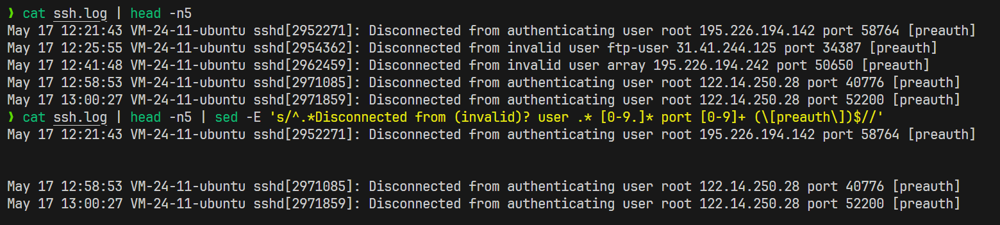​

### capture groups 捕获组

指用圆括号括起来的表达式。可以通过使用捕获组来对匹配到的文本进行分组，并在后续的操作中引用这些分组。

```Shell
cat ssh.log | head -n5 | sed -E 's/^.*Disconnected from (invalid)? user (.*) [0-9.]* port [0-9]+ (\[preauth\])$/\2/'
```

​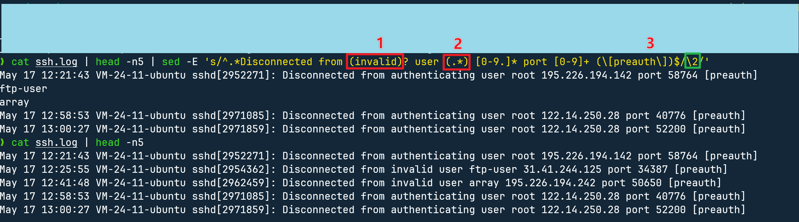​

### 正则调试 regex101.com

## sort

用于对文件或标准输入进行排序操作。该命令默认按照字典序（ASCII 码值）对文本进行排序

​`uniq`​ 是一个 Linux 命令，用于从输入中删除重复的行，并将结果写入输出。通常情况下，`uniq`​ 命令需要和排序命令 `sort`​ 一起使用，以确保相邻的重复行被合并在一起。 `-c`​ 选项可以统计每个行重复出现的次数，并在行首显示该次数。

​`sort`​ 的 `-r`​ 表示按照逆序，`-n`​ 表示按照数字大小排序，`-ka,b`​ 表示对第a列到第b列

```Shell
cat ssh.log | sed -E 's/^.*Disconnected from (invalid|authenticating)? user (.*) [0-9.]* port [0-9]+ (\[preauth\])$/\2/' | sort | uniq -c | sort -rnk1,1 | head -n10
```

​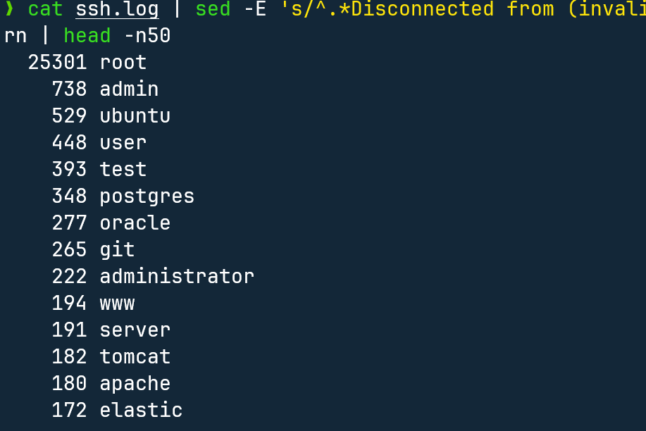​

## awk  对文本文件进行分割、过滤、格式化等操作

全称是 "Aho, Weinberger, and Kernighan"，它是一种文本处理工具，可以用于读取和处理文本文件中的数据。awk 命令支持对文本文件进行分割、过滤、格式化等操作，还可以进行数学计算、字符串处理、数组操作等高级操作。

以下是一些 awk 命令的使用示例：

1. 显示文件的第一列和第二列

```
awk '{print $1,$2}' filename
```

2. 显示文件的第一列和第二列，以冒号分隔

```
awk '{print $1":"$2}' filename
```

3. 显示文件的第一列和第二列，以制表符分隔

```
awk '{print $1"\t"$2}' filename
```

4. 计算文件中所有数字的总和

```
awk '{sum += $1} END {print sum}' filename
```

5. 显示文件中包含特定字符串的行

```
awk '/search_string/ {print}' filename
```

6. 根据文件中的某一列进行排序

```
awk '{print $2,$1}' filename | sort | awk '{print $2,$1}'
```

7. 将文件中的所有大写字母转换为小写字母

```
awk '{print tolower($0)}' filename
```

```Shell
cat ssh.log | sed -E 's/^.*Disconnected from (invalid|authenticating)? user (.*) [0-9.]* port [0-9]+ (\[preauth\])$/\2/' | sort | uniq -c | awk '$1 == 1 && $2 ~ /^c.*e$/ {print $0}' | paste -sd ','
```

​`$1`​ 表示第一列，`$2`​ 表示第二列。`==`​ 表示等于，`~`​ 表示匹配正则表达式。所以这个条件表示第一列等于 1，第二列匹配以 c 开头，以 e 结尾的字符串。

​`$0`​ 表示整行内容。输出整行内容。

```Shell
......| awk 'BEGIN { rows = 0} $1 == 1 && $2 ~ /^c.*e$/ {row += 1} END {print rows}'
在开始处理输入前执行的代码块。在这里，我们定义了一个变量 rows 并将其初始化为 0。
... 如果这两个条件都满足，则将 row 变量加 1。
处理完所有输入后执行的代码块。在这里，我们打印出 rows 变量的值，该变量存储了符合条件的行数。
等价于
......| awk '$1 == 1 && $2 ~ /^c.*e$/ {print $0}' | paste -sd ',' | wc -l
```

‍

## paste 用于将两个或多个文件按列合并，每个文件的对应行会被合并成一行，列之间用指定的分隔符隔开。

* ​`-d`​：指定列分隔符，默认为制表符。
* ​`-s`​：将文件按行合并为一行输出。

下面是一些示例：

1. 将两个文件按列合并：

```
$ cat file1.txt
apple
banana
orange

$ cat file2.txt
red
yellow
orange

$ paste file1.txt file2.txt
apple   red
banana  yellow
orange  orange
```

2. 使用逗号作为分隔符：

```
$ paste -d ',' file1.txt file2.txt
apple,red
banana,yellow
orange,orange
```

3. 将文件按行合并为一行输出：

```
$ paste -s file1.txt
apple   banana  orange
```

```Shell
cat ssh.log | sed -E 's/^.*Disconnected from (invalid|authenticating)? user (.*) [0-9.]* port [0-9]+ (\[preauth\])$/\2/' | sort | uniq -c | sort -rnk1,1 | head -n10 | awk '{print $2}' | paste -sd ','
```

​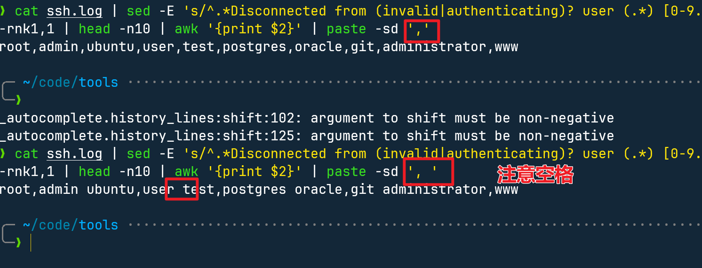​

## wc 用于统计文件中行数、单词数和字节数的命令。

* ​`-l`​：仅显示行数；
* ​`-w`​：仅显示单词数；
* ​`-c`​：仅显示字节数；
* ​`-m`​：仅显示字符数；
* ​`-L`​：仅显示最长行的长度。

如果不指定选项，则默认同时显示行数、单词数和字节数。

举个例子，假设我们有一个名为 `example.txt`​ 的文件，其中包含以下内容：

```
Hello world!
This is an example file.
It contains multiple lines of text.
```

我们可以使用 `wc`​ 命令来统计该文件的行数、单词数和字节数：

```
$ wc example.txt
 3 12 69 example.txt
```

输出结果中，第一列是行数，第二列是单词数，第三列是字节数，最后一列是文件名。

## bc 用于数学计算的命令行工具，可以执行高精度计算、支持变量、函数、条件语句等。

* ​`-l`​：加载标准数学库；
* ​`-q`​：安静模式，不输出欢迎信息；
* ​`-s`​：指定小数位数；
* ​`-w`​：宽输出，每行输出多个结果。

### 基本计算

使用 `bc`​ 命令进行基本计算，例如：

```
$ bc
2 + 2
4
10 / 3
3
scale=2
10 / 3
3.33
```

在 `bc`​ 命令中，输入表达式后按回车键即可得到计算结果。可以使用 `scale`​ 命令指定小数点后的位数。

### 变量和函数

​`bc`​ 支持变量和函数，使用 `var=value`​ 定义变量，例如：

```
$ bc
x=5
y=3
x + y
8
```

使用 `define name(params){statements}`​ 定义函数，例如：

```
$ bc
define square(x) {
    return x * x
}
square(5)
25
```

### 条件语句

​`bc`​ 支持条件语句，使用 `if (condition) {statements} else {statements}`​ 定义条件语句，例如：

```
$ bc
x=5
y=3
if (x > y) {
    x
} else {
    y
}
5
```

### 文件操作

​`bc`​ 支持从文件中读取表达式进行计算，使用 `bc file`​ 命令，例如：

```
$ cat test.txt
2 + 2
10 / 3
$ bc test.txt
4
3
```

例如我们想找到所有登录用户不为root的总登录次数

```Shell
cat ssh.log | sed -E 's/^.*Disconnected from (invalid|authenticating)? user (.*) [0-9.]* port [0-9]+ (\[preauth\])$/\2/' | sort | uniq -c | sort -rnk1,1 | awk '$2 != "root" {print $1}' | paste -sd '+' | bc -l
```

​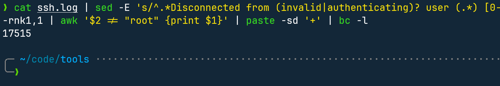​

## 结合 R 语言

```Shell
ssh myserver journalctl
 | grep sshd
 | grep "Disconnected from"
 | sed -E 's/.*Disconnected from (invalid |authenticating )?user (.*) [^ ]+ port [0-9]+( \[preauth\])?$/\2/'
 | sort | uniq -c
 | awk '{print $1}' | R --no-echo -e 'x <- scan(file="stdin", quiet=TRUE); summary(x)'
```

​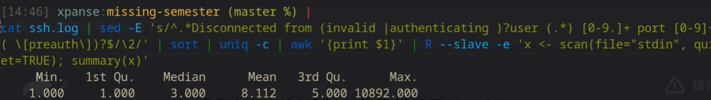​

## 画图

```Shell
ssh myserver journalctl
 | grep sshd
 | grep "Disconnected from"
 | sed -E 's/.*Disconnected from (invalid |authenticating )?user (.*) [^ ]+ port [0-9]+( \[preauth\])?$/\2/'
 | sort | uniq -c
 | sort -nk1,1 | tail -n10
 | gnuplot -p -e 'set boxwidth 0.5; plot "-" using 1:xtic(2) with boxes'
```

​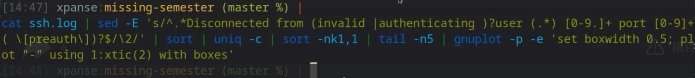​

​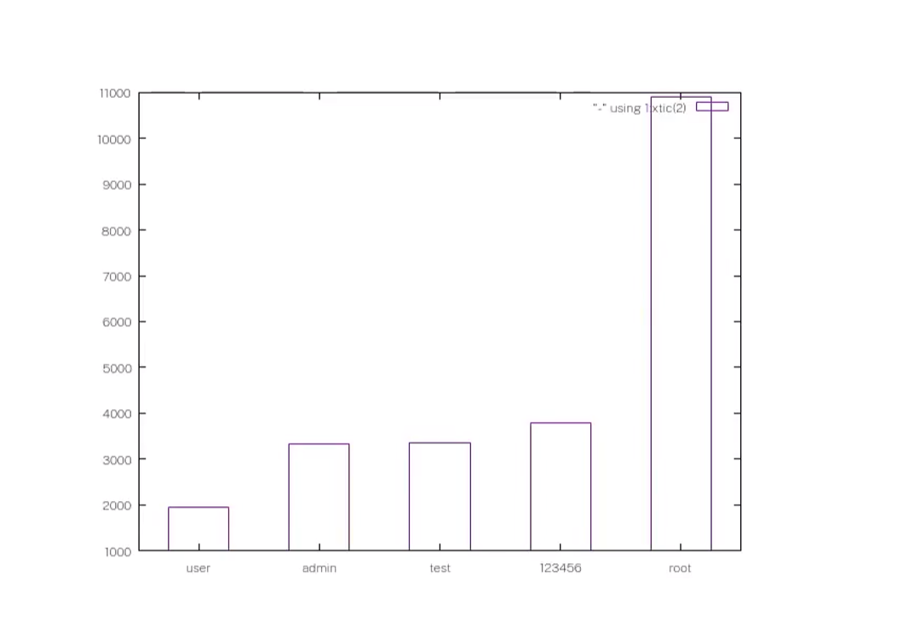​

## xargs 用于将标准输入的数据转换为命令行参数。

* ​`-0`​：使用 null 字符（\0）作为输入分隔符。
* ​`-I`​：指定替换字符串，替换命令行中的字符串。
* ​`-n`​：指定每次传递的参数数量。
* ​`-P`​：指定并行处理的进程数。

下面是一些常见的 xargs 命令示例：

1. 将文件名作为参数传递给 rm 命令：

```
find . -type f -name "*.txt" | xargs rm
```

2. 使用 xargs 和 grep 命令查找包含指定关键字的文件：

```
find . -type f -print0 | xargs -0 grep "keyword"
```

3. 使用 xargs 和 tar 命令创建归档文件：

```
find . -type f -name "*.txt" | xargs tar czvf archive.tar.gz
```

使用以下命令通过使用数据整理工具提取旧版本的 Rust 构建名称，然后通过 `xargs`​ 将它们传递给卸载程序来卸载我的系统中的旧版 Rust Nightly 构建。

​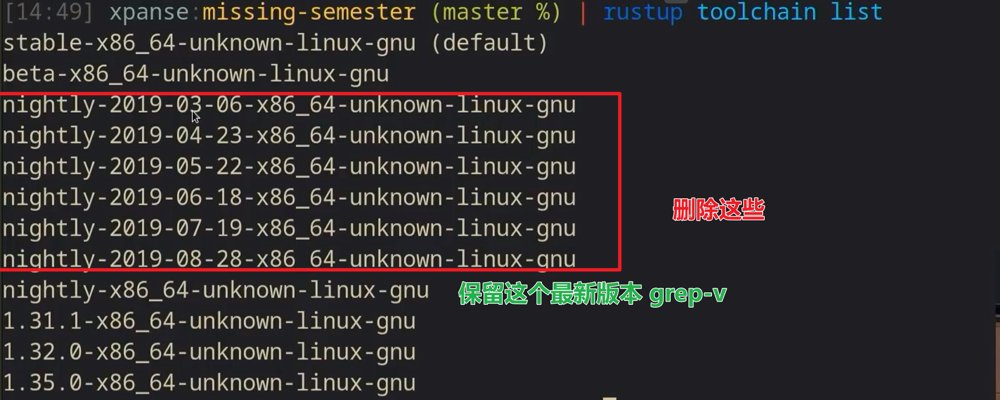​

```Shell
rustup toolchain list 
 | grep nightly 
 | grep -vE "nightly-x86"
 | sed 's/-x86.*//' # 卸载时只需要 nightly-2019-08-28 就够了
 | xargs rustup toolchain uninstall
```

‍

## ffmpeg 

使用 ffmpeg 从我们的相机捕获图像，将其转换为灰度，压缩它，通过 SSH 将其发送到远程机器，然后在那里解压缩它，制作一份副本，然后显示它。

```Shell
ffmpeg -loglevel panic -i /dev/video0 -frames 1 -f image2 -
 | convert - -colorspace gray -
 | gzip
 | ssh mymachine 'gzip -d | tee copy.jpg | env DISPLAY=:0 feh -'
```

1. ​`ffmpeg -loglevel panic -i /dev/video0 -frames 1 -f image2 -`​: 使用 ffmpeg 命令从摄像头读取一帧图像，并将其输出到标准输出（`-`​）。
2. ​`convert - -colorspace gray -`​: 使用 ImageMagick 的 `convert`​ 命令将输入的图像转换为灰度图像，并将其输出到标准输出。
3. ​`gzip`​: 使用 gzip 压缩标准输入，并将其输出到标准输出。
4. ​`ssh mymachine 'gzip -d | tee copy.jpg | env DISPLAY=:0 feh -'`​: 使用 SSH 将压缩的数据发送到另一台机器上。在该机器上，使用 gzip 解压缩数据，并将其保存到文件 `copy.jpg`​ 中。然后，使用 `feh`​ 命令在 X 窗口系统中显示该图像。

这个命令非常强大，因为它可以在不保存图像文件的情况下，将摄像头拍摄的图像实时显示在另一台机器上。

## 

# 5. 命令行环境

## Job control

### Killing a process / 终止一个进程

shell 使用一种名为信号的 UNIX 通信机制向进程传递信息。

当进程接收到信号时，它会停止执行，处理信号并根据信号传递的信息可能会改变执行流程。因此，信号是**软件中断**。

当键入 `Ctrl-C`​ 时，这会提示 shell 向进程发送 `SIGINT`​ 信号。

一个 Python 程序的最小示例，它捕获 `SIGINT`​ (按下`Ctrl-C`​) 并忽略它，不再停止。现在，我们可以使用 `SIGQUIT`​ 信号来终止此程序，方法是键入 `Ctrl-\`​ 

```Shell
#!/usr/bin/env python3
import signal, time

def handler(signum, time):
    print("\nI got a SIGINT, but I am not stopping")

signal.signal(signal.SIGINT, handler)
i = 0
while True:
    time.sleep(.1)
    print("\r{}".format(i), end="")
    i += 1
```

虽然 `SIGINT`​ 和 `SIGQUIT`​ 通常与终端相关的请求相关联，但更通用的请求进程优雅退出的信号是 `SIGTERM`​ 信号。要发送此信号，我们可以使用 `kill`​ 命令，语法为 `kill -TERM <PID>`​ 。

### 暂停和后台处理

​`SIGSTOP`​ 可以暂停进程。在终端中，输入 `Ctrl-Z`​​ ​将提示 shell 发送一个 `SIGSTOP`​ 信号，简称终端停止

可以使用 `fg`​ 或 `bg`​ 在前台或后台继续暂停的作业。

​`jobs`​ 命令列出与当前终端会话关联的未完成作业。您可以使用它们的 pid 引用这些作业（您可以使用 `pgrep`​ 查找）。更直观的是，您还可以使用百分号后跟其作业编号（由 `jobs`​ 显示）来引用进程。要引用最后一个后台作业，可以使用 `$!`​ 特殊参数。

命令中的 `&`​ 后缀将在后台运行命令

要将已经运行的程序放到后台，您可以执行 `Ctrl-Z`​以暂停当前任务 ，然后执行 `bg`​ 。请注意，后台进程仍然是终端的子进程，如果关闭终端，它们将会终止（这将发送另一个信号 `SIGHUP`​ ）。为了防止这种情况发生，您可以使用 `nohup`​ 运行程序（一个忽略 `SIGHUP`​ 的包装器），或者如果进程已经启动，可以使用 `disown`​ 。或者，您可以使用终端复用器

```
$ sleep 1000
^Z
[1]  + 18653 suspended  sleep 1000

$ nohup sleep 2000 &
[2] 18745
appending output to nohup.out

$ jobs
[1]  + suspended  sleep 1000		# 加号表示最近一个被停止的作业
[2]  - running    nohup sleep 2000	# 减号表示最近一个被启动的作业

$ bg %1
[1]  - 18653 continued  sleep 1000

$ jobs
[1]  - running    sleep 1000
[2]  + running    nohup sleep 2000

$ kill -STOP %1
[1]  + 18653 suspended (signal)  sleep 1000

$ jobs
[1]  + suspended (signal)  sleep 1000
[2]  - running    nohup sleep 2000

$ kill -SIGHUP %1
[1]  + 18653 hangup     sleep 1000

$ jobs
[2]  + running    nohup sleep 2000

$ kill -SIGHUP %2 或 kill -HUP %2

$ jobs
[2]  + running    nohup sleep 2000 # 依旧运行中，nohup 会把命令封装起来，忽略所有 HUP 信号(这样在关闭窗口/断开SSH连接时，任务会继续执行)

$ kill %2
[2]  + 18745 terminated  nohup sleep 2000

$ jobs
```

## 终端复用器 Tmux

[tmux 使用](https://www.notion.so/insv2/11c0e36b7ea4426fb3683426b94ddbaa?p=8c63b4ea41374da7b5e6267d71bdca26&amp;pm=s)

配置文件位于用户的 home 目录下的 `.tmux.conf`​ 文件

修改 tmux.conf 后需要重新加载配置文件才能生效。你可以通过以下两种方式来重新加载：

1.在终端中输入 `tmux source-file ~/.tmux.conf`​ 命令重新加载配置文件。

2.在 tmux 终端中使用快捷键 `Prefix`​（默认为 Ctrl+b） + `:`​ 进入命令行模式，然后输入 `source-file ~/.tmux.conf`​ 命令重新加载配置文件。

无论你采用哪种方式，都应该能够看到 tmux 的配置文件已经成功重新加载了，你修改的配置项也已经生效了。

* Sessions - Windows - Panes

  会话 - 窗口 - 窗格

定义 <pre> 为前缀操作，默认为 <Ctrl-b>，可更改为 <Ctrl- a>，第2个指令前缀为 ```​

* ### Sessions

  ​`tmux`​ 开始一个新会话(无名字)

  ​`tmux new -s NAME`​ 开始一指定名字的新会话

  ​`<pre> $`​重命名当前会话

  ​`tmux ls`​ 列出当前会话

  ​`tmux a`​ 连接上一次会话

  ​`tmux a -t NAME`​ 指定连接的会话名字

  在 tmux session 中时，输入 `<pre> d`​ 将断开当前会话。（tmux 仍在后台运行）

* ### Windows

  ​`<pre> c`​ 创建(Create)新窗口，使用 `<Ctrl-d>`​关闭当前窗口

  ​`<pre> 数字`​前往第几个窗口

  ​`<pre> p`​/ `<pre> n`​ 上/下一个窗口

  ​`<pre> ,`​ 重名名当前窗口

  ​`<pre> w`​ 列出当前窗口

  ​`<pre> &`​ 关闭当前窗口
* ### Panes

  ​`<pre> %`​划分成左右两个窗格

  ​`<pre> "`​(双引号)划分成上下两个窗格

  ​`<pre> 空格`​循环浏览窗格布局

  ​`<pre> ;`​/`<pre> o`​光标切换到上/下一个窗格

  ​`<pre> 方向键`​光标切换到指定方向的窗格

  ​`<pre> x`​关闭当前窗格，需输入 y 确认

  ​`<pre> !`​将当前窗格拆分为一个独立窗口

  ​`<pre> z`​将当前窗格全屏显示，再使用一次恢复原来大小

  ​`<pre> q`​显示窗格标号
* ### 文本复制模式

  ​`<pre> [`​ 进入文本复制模式，按 `<space>`​ 开始选择，按 `Enter`​ 复制所选内容

  ​`<pre> ]`​ 黏贴刚刚复制的文本

## dotfiles

### alias

设置提示符

​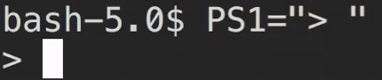​

## remote machine

 ssh 命令后可直接跟命令

```Shell
ssh user@ip ls -la
```

如何将本地公钥上传到服务器 .ssh/authorized_keys

```Shell
cat ~/.ssh/id_ed25519.pub | ssh user@ip tee -a .ssh/authorized_keys
```

### 传文件 scp / rsync

# 6. 版本控制 Git

## 本地

```Shell
git checkout 哈希值
git checkout 分支名(如 main, bugfix) # 切换到'分支名'分支
```

```Shell
git diff 分支哈希 文件名 	# 比较文件当前内容和分支哈希上的该文件的内容 
git diff 文件名 		# 比较文件当前内容和 head 所指节点处该文件的内容
git diff 分支哈希1 分支哈希2 文件名
```

```Shell
git branch 	# 展示所有分支(包括远程)
git branch 分支1	# 新分支
```

```Shell
显示 Git 仓库中所有分支的提交历史，并以图形化的方式展示它们之间的关系。
具体来说，
--all 参数表示显示所有分支的历史记录，
--graph 参数表示用 ASCII 图形方式展示提交历史，
--decorate 参数表示在图形中显示分支和标签的名称。
git log -all --graph --decorate

以一行的方式展示每个提交的信息。这样可以更加简洁地显示提交历史，方便你快速浏览和查找相关提交。
git log -all --graph --decorate --oneline 
```

```Shell
git merge 分支名
注意，一般先 checkout 到主分支(如 main)，然后 merge 其他分支(如 bugfix)

放弃合并
git merge --abort

手动合并
vim 冲突文件

手动合并完成后，先提交，继续合并
git add 修改完的冲突文件
git merge --continue
```

如果出现 Git 无法自己处理的冲突，需手动 merge。

使用工具 `git mergetool`​，配置好后出现冲突会启动 vimdiff 来让我们对比观看冲突部分

---

## 远程

```Shell
git remote add <remote_name> <remote_url>
远程仓库<remote_name>默认为 origin
```

```Shell
git push <remote_name> <local_branch_name>:<remote_branch_name>
每次都要输这么长很麻烦
git branch --set-upstream-to=<remote_name>/<remote_branch_name>
只需输入 git push 就好
```

```Shell
git clone <remote_url> <位置>
如果指定了位置，则只会把远程仓库的内容拉下来，不会在该位置下新建一个名为'仓库名'目录
```

```Shell
git fetch
用于从远程仓库中获取最新的代码和分支信息，但并不会将其合并到本地代码中。
它主要用于更新本地代码库中的远程分支状态，以便在本地分支上进行合并操作或者查看远程分支的状态。
执行 git fetch 命令后，可以通过 git branch -r 命令查看远程分支的列表，
通过 git checkout 命令切换到指定的远程分支进行操作，
或者通过 git merge 命令将远程分支合并到本地分支中。
```

```Shell
git pull 等于先 git fetch，然后 git merge，
```

## git config

‍

---

### git clone --shallow

* 用于克隆一个浅层次的 Git 仓库，即只克隆最近的一些提交记录，而不是完整的历史记录。这可以在需要快速克隆大型仓库时提高克隆速度和减少克隆所需的存储空间。
* 使用 git clone --shallow 命令时，可以通过指定 --depth=<depth> 参数来控制克隆的深度，例如 git clone --shallow --depth=1 <repository> 只会克隆最近的一次提交记录。
* 需要注意的是，浅层次克隆仅适用于只读操作，无法进行推送等修改操作，因为缺少完整的历史记录。如果需要进行修改操作，可以使用 git fetch --depth=<depth> 命令来获取更多的历史记录。

### git add -p

​`git add -p`​ 命令可以让你逐个地添加修改过的文件或者修改过的代码块到 Git 的暂存区，而不是一次性地添加所有修改。这个命令非常有用，因为它可以帮助你检查每个修改，避免不必要的错误和提交不必要的代码。

下面是一个 `git add -p`​ 的例子：

假设我们有一个文件 `example.txt`​，其中有以下两个代码块：

```
This is the first block of code.
It does something very important.
```

```
This is the second block of code.
It does something even more important.
```

现在我们修改了第一个代码块，将其改成了：

```
This is the first block of code.
It does something very important.
And it does it even better now.
```

我们可以使用 `git add -p`​ 命令来逐个地添加修改过的代码块到暂存区。运行命令后，会显示以下提示：

```
diff --git a/example.txt b/example.txt
index 1a2b3c..4d5e6f 100644
--- a/example.txt
+++ b/example.txt
@@ -1,4 +1,4 @@
 This is the first block of code.
-It does something very important.
+It does something very important.
+And it does it even better now.

 This is the second block of code.
 It does something even more important.
Stage this hunk [y,n,q,a,d,/,s,e,?]? 
```

这个提示显示了修改的代码块，以及它们的差异。我们可以使用以下命令来添加修改过的代码块：

* ​`y`​：将当前代码块添加到暂存区。
* ​`n`​：不将当前代码块添加到暂存区。
* ​`q`​：退出 `git add -p`​ 命令。
* ​`a`​：将当前代码块以及后面所有的代码块都添加到暂存区。
* ​`d`​：不将当前代码块以及后面所有的代码块都添加到暂存区。
* ​`/`​：搜索包含指定字符串的代码块。
* ​`s`​：将当前代码块分割成更小的代码块。
* ​`e`​：手动编辑当前代码块。
* ​`?`​：显示帮助信息。

在这个例子中，我们可以按下 `y`​ 键来将修改过的代码块添加到暂存区。然后，我们可以继续修改文件并使用 `git add -p`​ 命令逐个地添加修改过的代码块到暂存区。最后，当我们完成所有的修改并确认要提交时，可以使用 `git commit`​ 命令来提交代码。

### git blame

​`git blame`​ 命令用于显示指定文件的每一行代码是由哪个提交记录引入的，并且还会显示引入该行代码的作者和提交时间等信息。该命令常用于查找代码中的问题或者追溯代码的修改历史。

执行 `git blame`​ 命令时，需要指定要查看的文件名，例如：

```
git blame myfile.txt
```

该命令会输出指定文件的每一行代码的详细信息，包括该行代码所在的提交记录的哈希值、作者、提交时间和注释等信息。例如：

```
f6f2b7d5 (John Doe 2021-07-01 10:00:00 +0800 1) This is the first line of myfile.txt
8d9a3e47 (Jane Smith 2021-07-02 11:00:00 +0800 2) This is the second line of myfile.txt
f6f2b7d5 (John Doe 2021-07-01 10:00:00 +0800 3) This is the third line of myfile.txt
```

其中，每一行的第一部分是引入该行代码的提交记录的哈希值，第二部分是该行代码的作者，提交时间和行号，第三部分是该行代码的内容。

通过执行 `git blame`​ 命令，可以方便地了解每一行代码的历史修改情况，以及修改该行代码的作者和时间等信息，有助于进行代码审查和调试。

### git stash

​`git stash`​ 命令用于将当前工作目录中的修改暂时保存起来，并将工作目录恢复到之前的状态，以便进行其他操作。该命令常用于在切换分支或者处理其他任务时，暂时保存当前的修改，以免丢失或者影响其他操作。

执行 `git stash`​ 命令时，会将当前工作目录中的修改保存到一个栈中，并将工作目录恢复到之前的状态。如果希望在保存时添加说明信息，可以使用 `-m`​ 参数，例如：

```
git stash save -m "add new feature"
```

执行该命令后，会将当前工作目录中的修改保存到一个新的 stash 记录中，并添加说明信息为 "add new feature"。

如果需要查看当前的 stash 记录，可以使用 `git stash list`​ 命令，例如：

```
git stash list
```

该命令会列出当前的 stash 记录，包括记录的编号、说明信息和保存的修改数量等信息。

如果需要恢复之前保存的修改，可以使用 `git stash apply`​ 命令，并指定要恢复的 stash 记录的编号，例如：

```
git stash apply stash@{0}
```

该命令会将 stash 记录中保存的修改应用到当前工作目录中，并保留 stash 记录。如果希望删除 stash 记录，可以使用 `git stash drop`​ 命令，并指定要删除的 stash 记录的编号，例如：

```
git stash drop stash@{0}
```

该命令会删除指定的 stash 记录，并将栈中的其他记录向上移动。

通过使用 `git stash`​ 命令，可以方便地保存和恢复当前工作目录中的修改，以便进行其他操作，提高开发效率。

### git bisect

​`git bisect`​ 是一个 Git 命令，用于帮助你快速定位代码中引入 bug 的提交。它通过二分查找的方式，自动在 Git 提交历史中查找引入 bug 的提交。

使用 `git bisect`​ 命令的步骤如下：

1. 首先，使用 `git bisect start`​ 命令开始查找。这将会把当前的 commit 标记为 bad。
2. 然后，你需要指定一个好的 commit，即你知道不包含 bug 的 commit，使用 `git bisect good <commit>`​ 命令指定。
3. 接下来，Git 会自动切换到一个中间的 commit，你需要测试这个 commit 是否包含 bug。如果包含，使用 `git bisect bad`​ 命令标记为 bad，否则使用 `git bisect good`​ 命令标记为 good。
4. 重复步骤 3，直到 Git 找到引入 bug 的 commit。
5. 最后，使用 `git bisect reset`​ 命令结束查找，并返回到最初的 commit。

通过使用 `git bisect`​ 命令，可以快速定位代码中引入 bug 的提交，从而更快地修复问题。

# 7. 调试及性能分析

‍

tac 是 cat 的反向

‍

‍

# 9. 安全和密码学
